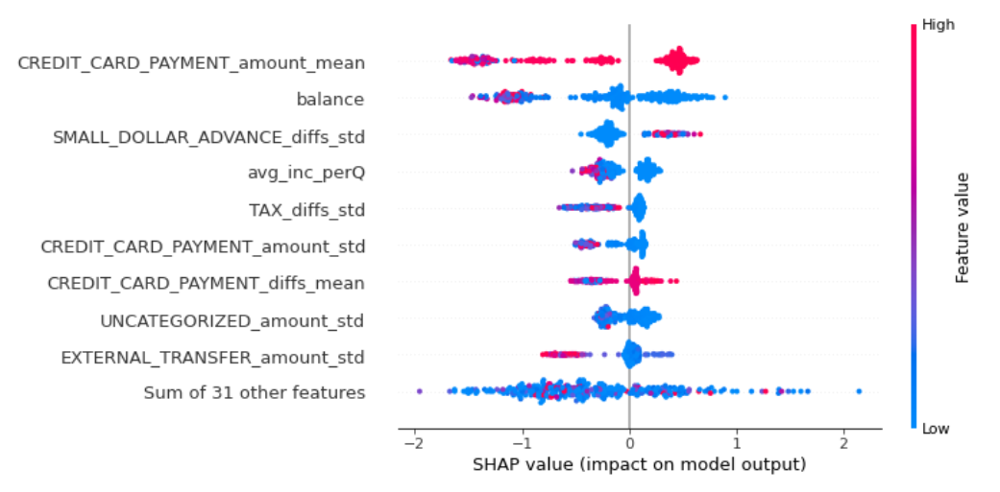

--- 
layout: default
---

# Background Information: Why is Credit Score Important? 

In the dynamic realm of financial services, determining creditworthiness is essential for risk management, economic stability, and informed lending decisions. Traditionally anchored by the FICO score, the assessment of creditworthiness relies on creditors' periodic reporting, typically spanning one to forty-five days. This time frame, however, introduces a significant shortfall in the traditional scoring system: its inability to promptly encapsulate the nuances of an individual's financial behavior and emerging risks, thereby compromising the decision-making process in lending. 

## How we approach this issue: 

Machine Learning (ML) Utilization: Harnessing advanced ML models to devise a "Cash Score," aiming at a real-time reflection of creditworthiness.
Feature Engineering: Incorporating detailed financial indicators such as income, balance, and spending patterns to enhance prediction accuracy.
Objective: To refine creditworthiness assessment, making it more efficient and accurate.

# Methods:

### Overview:
We utilized the categories and income estimate to build a score to predict the risk of a consumer not paying his/her bills. To predict the probability of someone defaulting or not, we need to train a model using information such as an individual's income, balance, and categories as the features to make the prediction. 

In this section, we will introduce the methodologies employed in our cash score prediction model. To prepare for the cash score calculation, we need to create relevant features to better understand consumers' financial behavior, which allows us to predict the probability of default. We tested 3 different types of models for this prediction task: 
1. Logistic Regression
2. XGBClassifier
3. SGDClassifier

Logistic Regression, XGBClassifier, and SGD were trained on features from balance, income, and consumption, which are derived from transaction and balance datasets. 

### Feature selection:
There are three most important aspects we focus on:
- Income
- Consumption
- Account Balance
  
Tracking changes in consumers' income helps gauge their financial stability and well-being. Regular, reliable income suggests lower risk while fluctuating income indicates higher uncertainty. Higher-income generally correlates with better financial health and a lower chance of default.

Analyzing consumption patterns can reveal potential red flags in spending habits, differentiating between essential and discretionary expenses. High discretionary spending relative to income might indicate financial imprudence.

Lastly, a consumer's account balance is a key financial health indicator, reflecting their asset liquidity. Higher balances suggest stability and lower default risk, while lower balances can indicate financial trouble.

>>| Feature              | Category 
>>|---------------------|---------------|
>>| Consumer's Net Income | Income         | 
>>| Individual's Total Transaction Count       | Consumption      | 
>>| Net Balance and Account Type       | Account Balance          | 
>>| Consumption on Single Category     | Consumption              | 
>>| Monthly Consumption       | Consumption      | 
>>| Monthly Outflow/Inflow       |Consumption, Income          | 
>>| Average Monthly Inflow/Outflow Per Category       | Consumption, Income          | 
>>| Average Percentage Change of Income Over Months | Income |
>>| Average Income Per Month | Income |

### Models: 

# Results:

After rigorous feature selection and hyper-parameter tuning, the XGBClassifier emerged as the top-performing model among Logistic Regression and SGDClassifiers. The performance metrics, namely accuracy and ROC-AUC score, demonstrate its superiority:

| Model               | ROC-AUC Score | Accuracy |
|---------------------|---------------|----------|
| Logistic Regression | 0.83          | 0.83     |
| XGBClassifier       | 0.86          | 0.84     |
| SGDClassifier       | 0.79          | 0.79     |

XGBoost's exceptional performance can be attributed to its capability to capture non-linear relationships within the dataset, which linear models like Logistic Regression might overlook. The model's accuracy in predicting default risk underscores its potential in refining credit scoring methodologies, thereby enhancing the efficiency of creditworthiness assessments.

Utilizing the XGBClassifier alongside the SHAP Python package provided deeper insights into the influential factors driving predictive accuracy. Notably, features such as average credit card payment amount and consumer balances played pivotal roles. Analyzing SHAP values revealed that when consumer balances increase, the prediction tends towards a lower default risk.

These findings underscore the importance of comprehending consumer credit behavior for making informed lending decisions. By pinpointing critical factors, this study paves the way for more accurate credit scoring, enabling financial institutions to mitigate risks effectively and make smarter lending choices.

# Conclusion:
