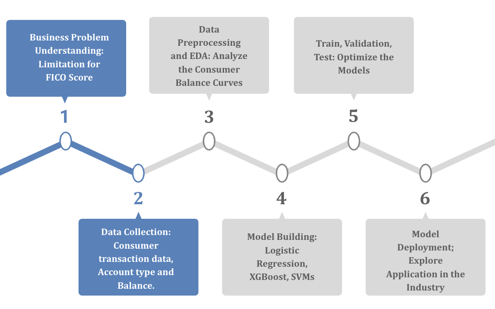
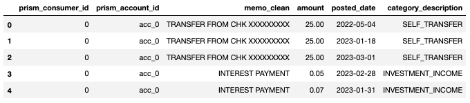
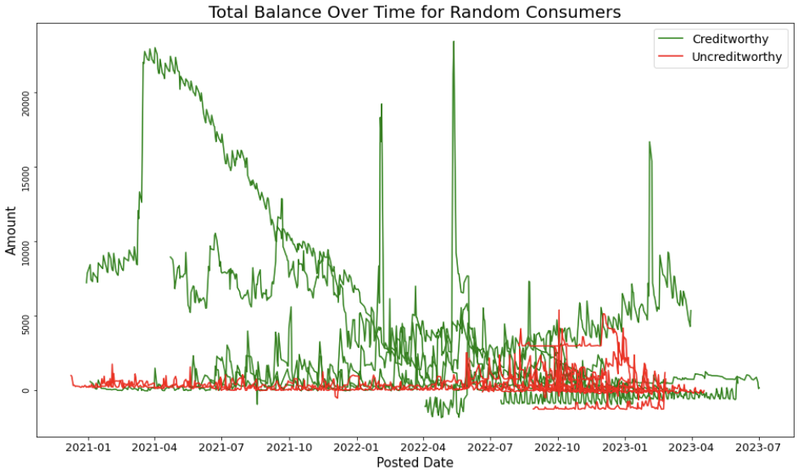
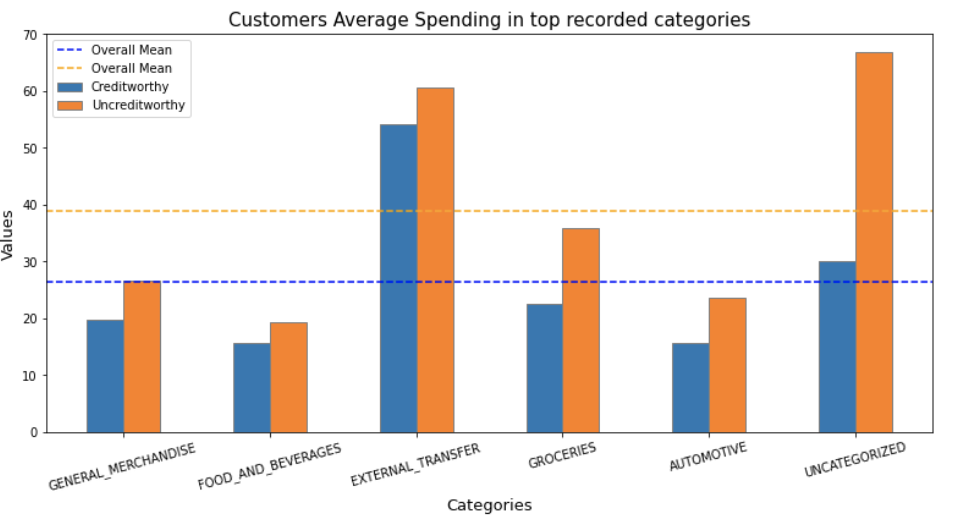

--- 
layout: default
---

# Introduction

## Why is Credit Score Important? 

In the dynamic realm of financial services, determining creditworthiness is essential for risk management, economic stability, and informed lending decisions. Traditionally anchored by the FICO score, the assessment of creditworthiness relies on creditors' periodic reporting, typically spanning one to forty-five days. This time frame, however, introduces a significant shortfall in the traditional scoring system: its inability to promptly encapsulate the nuances of an individual's financial behavior and emerging risks, thereby compromising the decision-making process in lending. 

## Approach

Our strategy revolves around employing advanced Machine Learning (ML) techniques to create a novel "Cash Score," which provides a real-time assessment of creditworthiness. To achieve this, we're diving into detailed financial data, including income sources, account balances, and spending patterns. By carefully analyzing these indicators and leveraging sophisticated ML models, we aim to enhance the accuracy of our predictions.

Our overarching objective is twofold: to refine the creditworthiness assessment process, making it more efficient and precise. Through our approach, we strive to introduce a scoring system that not only reflects the dynamic nature of financial behavior but also empowers stakeholders with actionable insights for informed decision-making.

## Project Life Cycle

## Datasets

Our project leverages datasets generously provided by Prism Data, comprising real bank transaction data. Together, these datasets contain approximately 500,000 transaction records, offering a wealth of information on monetary inflows, outflows, and consumer spending habits. Additionally, the datasets encompass details on approximately 3,000 consumers and 5,000 accounts, providing a comprehensive view of their financial behavior. Each consumer has an associated value in the dataset containing whether or not they paid back their loan. This allows us to train models using that as our predictive value. You may find an example inflows dataset below, which contains inflow transactions of consumers.

# Methods

### Overview
We utilized the categories and income estimate to build a score to predict the risk of a consumer not paying his/her bills. To predict the probability of someone defaulting or not, we need to train a model using information such as an individual's income, balance, and categories as the features to make the prediction. 

In this section, we will introduce the methodologies employed in our cash score prediction model. To prepare for the cash score calculation, we need to create relevant features to better understand consumers' financial behavior, which allows us to predict the probability of default. We tested 3 different types of models for this prediction task: 
1. Logistic Regression
2. XGBClassifier
3. SGDClassifier

Logistic Regression, XGBClassifier, and SGD were trained on features from balance, income, and consumption, which are derived from transaction and balance datasets. 

### Feature selection
There are three most important aspects we focus on:
- Income
- Consumption
- Account Balance
  
Tracking changes in consumers' income helps gauge their financial stability and well-being. Regular, reliable income suggests lower risk while fluctuating income indicates higher uncertainty. Higher-income generally correlates with better financial health and a lower chance of default.

Analyzing consumption patterns can reveal potential red flags in spending habits, differentiating between essential and discretionary expenses. High discretionary spending relative to income might indicate financial imprudence.

Lastly, a consumer's account balance is a key financial health indicator, reflecting their asset liquidity. Higher balances suggest stability and lower default risk, while lower balances can indicate financial trouble.

| Feature                                           | Category          |
|---------------------------------------------------|-------------------|
| Consumer's Net Income                             | Income            |
| Individual's Total Transaction Count              | Consumption       |
| Net Balance and Account Type                      | Account Balance   |
| Consumption on Single Category                    | Consumption       |
| Monthly Consumption                               | Consumption       |
| Monthly Outflow/Inflow                            | Consumption, Income |
| Average Monthly Inflow/Outflow Per Category       | Consumption, Income |
| Average Percentage Change of Income Over Months   | Income            |
| Average Income Per Month                          | Income            |

When randomly selecting 10 customers from each target group, we noticed a consistent trend: Creditworthy customers (green lines) tend to have higher and more fluctuating balances over time, whereas Uncreditworthy Customers (red lines) occasionally exhibit low or even negative balances. This observation inspired us to explore balance-related features for prediction purposes.

Additionally, we found that Creditworthy customers typically spend less than Uncreditworthy customers in top recorded categories. This led us to speculate that Creditworthy customers are generally more budget-conscious and avoid unnecessary expenditures. As a result, we are motivated to delve into average computations and other relevant factors.

### Models

#### Logistic Regression Model
- We also focus on the logistic regression model for predicting individuals' cash scores, which captures the probability of someone not paying back their bills. It stands out because Logistic regression is designed specifically for binary outcome variables, making it ideal for predicting whether a consumer will pay (1) or not pay (0) their bills. It estimates probabilities that are bounded between 0 and 1, aligning with the need to assess the risk of a binary event.

#### XGB Classifier Model

- XGBClassifier refers to the eXtreme Gradient Boosting Classifier. It is based on gradient boosting, an ensemble technique where new models are created to correct the errors made by existing models. XGBoost uses decision trees as its base learners. There are several strengths of XGBClassifier that meets our need for the credit assessment task. It includes built-in regularization which helps to prevent overfitting. At the same time, we can adjust a variety of tuning parameters that can be optimized for better model performance.

#### SGD Classifier Model
- We chose a Stochastic Gradient Descent (SGD) classifier with hinge loss, which functions like a linear Support Vector Machine (SVM), due to its suitability for linearly separable data and resistance to overfitting. The model excels in identifying linear relationships between features and outcomes, crucial for our dataset. It also handles class imbalance well, improving accuracy and demonstrating our strategy to select models that complement our data's specific traits and boost prediction quality.

# Results

After rigorous feature selection and hyper-parameter tuning, the XGBClassifier emerged as the top-performing model among Logistic Regression and SGDClassifiers.

| Model               | ROC-AUC Score | Accuracy |
|---------------------|---------------|----------|
| Logistic Regression | 0.83          | 0.83     |
| XGBClassifier       | 0.86          | 0.84     |
| SGDClassifier       | 0.79          | 0.79     |

XGBoost's performance can be attributed to its capability to capture non-linear relationships within the dataset, which linear models like Logistic Regression might overlook. The model's accuracy in predicting default risk underscores its potential in finding risky consumers, which is valuable to fin

Utilizing the XGBClassifier alongside the SHAP Python package provided deeper insights into the features driving predictive accuracy. Notably, features such as average credit card payment amount and consumer balances played pivotal roles. Analyzing SHAP values revealed that when consumer balances increase, the prediction tends towards a lower default risk.

These findings underscore the importance of comprehending consumer credit behavior for making informed lending decisions. With concrete interpretability, these findings pave the way for more accurate credit scoring, enabling financial institutions to mitigate risks effectively and make smarter lending choices.

# Conclusion

This project aimed to explore various machine learning models to ascertain their efficacy in predicting consumers' credit risk. The XGBClassifier outperformed both the logistic regression and the SGDClassifier by achieving an ROC-AUC score of 0.86 and accuracy of 0.84. It is capable of handling diverse predictive tasks in the financial domain, when the data involves complex, non-linear relationships. 

We also created reason codes that allow consumers to know which features/factors are having the greatest impact on their credit scores. They would be able to see which category makes the final prediction toward the negative direction, which makes them more risky compared to the average consumer. 

The four main impacts and capabilities of our approach:
- Reduce the probability of default risk
- Can be readily applied in various decision-making processes within financial institutions.
- Greater financial inclusion 
- Operational efficiency

However, despite the positive feedback from our model, there are a few limitations in our approach. The efficacy of our model has highly relied on the quality and representativeness of the dataset in question. Without a stable data source, this approach may not accurately predict the risk of defaulting. At the same time, the interpretability of XGBoost is not completely transparent due to the complexity and non-linear nature of how it makes decisions. 

Future research can build upon our findings by adding more relevant features to further enhance predictive accuracy. Any additional information that closely reflects consumer behaviour could improve model performance. 

In conclusion, our results offer a potential implication for the financial industry, presenting opportunities to advance credit risk assessment practices. Financial institutions can achieve more accurate , efficient, and equitable lending processess by leveraging the XGBClassifier. 
